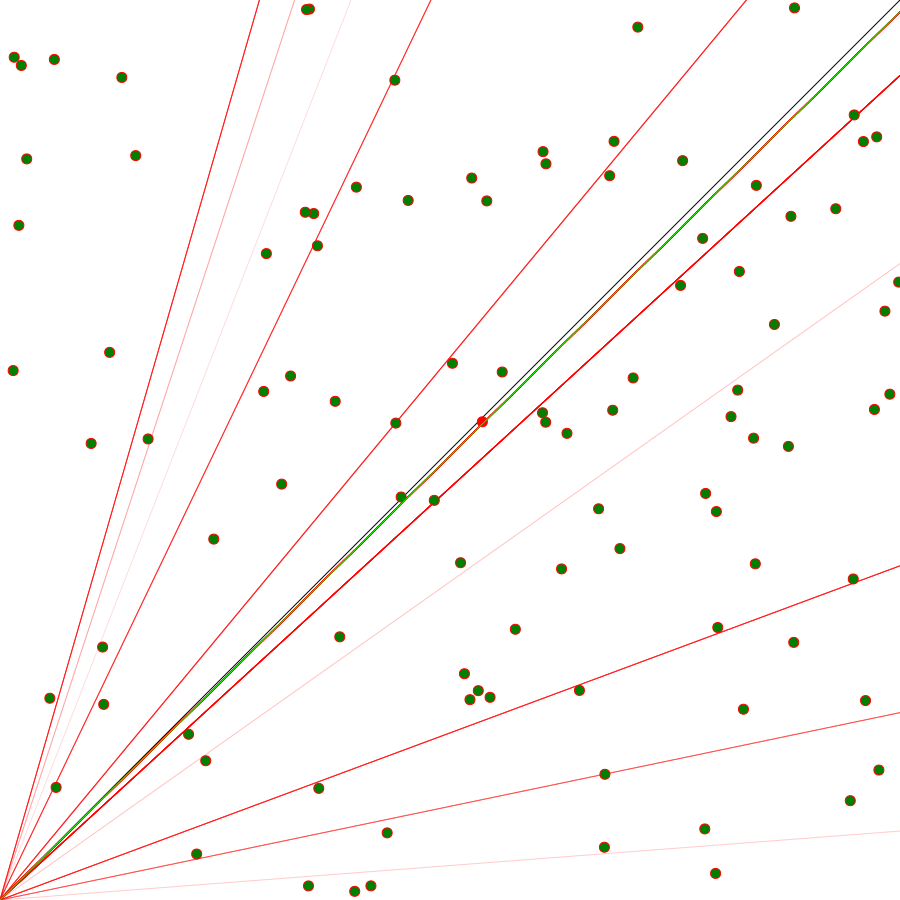

# Perceptron implementation in javascript


basic machine learning aglorithm that learns to classify if a point is on the top or bottom side of the function f(x) = x.


### run
```
npm i
npm start
```

### preview


